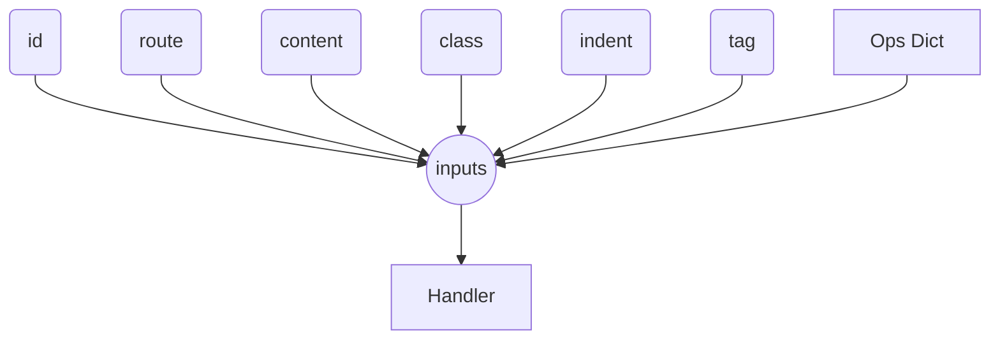

# Event Handling

Your build process can take an active and dynamic approach toward mutating state in the transformation pipeline. This is done within the "hooks" section of the configuration you pass Darkmatter. Each "hook" represents your build process expressing its desire on how to mutate a given _event_ in the pipeline.

While each event may have a few specifics that you'll want to grasp, it has been generalized as much possible across events/hooks.

## Event Lifecycle

Every event will fire 0:M times _per document_ and your goal is to express what you'd like to _mutate_ between the "inputs" and "outputs" of any given event. Sometimes you'll want something static to be set, other times you'll rely on the inputs of that specific event to determine the output. In all cases you can imagine at a high-level hook to look something like this:

Where the inputs consist of:

- `id` - the unique identifier of the document; this starts out the same as `route` but whereas `route` can be mutated; `id` can not be.
- `route` - the full route of the document which includes the filename of document (if sourced from a file) or the `id` of the record (if sourced from a database). Of course, if you decided to mutate the route for a given page page this could be changed.
- `content` - the primary content which this event-type is designed to give you access to; in most cases this is a string which represents the `html`, `md`, etc. but it can be structured data like what you'd receive in the case of the [`TOC`]() event hook.
- `class` - in virtually all cases an event provides the space-delimited class list that the content's wrapping element has on it. If no classes are set then this will be an empty string.
- `indent` - the indentation level of the event's content is passed in as read-only informational content.
- `tag` - is the name of the HTML tag which contains the "contents"
