# Transformation Pipeline

- configured (after initialize hook)
- split (markdown and frontmatter split)
- frontmatter (defaults and overrides)
- static template replacement (allows )
- nlp (using markdown as input)
- **darkmatter is ready**
- parse md-to-html (using callback hooks)

## Starting the Service

```sh
# if not already installed
cargo install darkmatter
# start the service
cargo darkmatter
```

When the **Darkmatter** service starts it becomes immediately available for all REST and Websocket clients. Once the API is ready, the service will check in the background for any stale cache entries across all known projects. Stales entries will be kept current in the cache database but only active projects (aka, those which _initialize_ Darkmatter) will have their cache entries refreshed.

## Darkmatter Caching

- Darkmatter's cache uses a SQLite database as it's cache store
- Active projects will bring Stage 0 and 1 _hashes_ into memory for greater performance; this shouldn't be an issue for any but the most memory constrained or content rich sites.
- It is a multi-stage cache which can cache the following content types:
  - Stage 0
    - Repo Config (stores only a hash of config)
  - Stage 1
    - Markdown (hash and content)
    - Frontmatter (hash and content)
  - Stage 2
    - HTML (hash and content of transformed HTML)
  - Stage 3
    - Darkmatter
    - VueJS SFC format (hash and content)
- When any cache element becomes stale, all artifacts at deeper stages are assumed stale as well

## Time Series Data

To understand change over time, Darkmatter tracks change in:

- Pages:
  - creation
  - removal
  - changed (TOC Naming, TOC Structure, prose, code blocks, list modifications)
- Repo Dependencies (version from/to)
- Cache Effectiveness (hit/miss ratios by stage)
- Build Timing (build timing metrics)
- Page Load Metrics

Rather than tracking changes at point of inception, Darkmatter instead waits to receive instruction of a "release" by a call to the REST API at: `POST /release/x.y.z`. This release will be marked as "review" and can be moved to "released" or "rejected" with calls to `POST /release/x.y.z/[state]`.

If you're in a pre-release stage and just want get a full build without the intention of this being considered a formal release simply call `POST /release` without stating a version number.

> All time-series data is kept in a InfluxDB which is run alongside Darkmatter; Darkmatter leverages this store for some reporting but you may also directly point your browser to `localhost:8086` to use the InfluxDB console to query your data.

## Project Initialization

The Darkmatter service is started with a completed [configuration](./configuration.md) passed in by the user and results in an initialization of the Transformation cache.

```mermaid
flowchart LR
    fm([Frontmatter])
    hooks([Hooks])
    nlp([NLP])
    docs([Doc Scope])

    docs --> config([Configuration])
    fm --> config
    hooks --> config
    nlp --> config
    config --> init[Initialize]

    subgraph Initialization
    init --> files[File Scope]
    files .-> |glob| files
    init --> db[DB Scope]
    db .-> |query| db
    files --> scope(scope)
    scope --> active(prj active)
    db --> scope

    end
    active --> validate[validate item]
    cache[(cache db)] --> cmp
    validate -->cmp{hash diff}
    cmp -->|same| validate

    rest[REST returns]
    ws[WS message]

    active --> rest
    active --> ws
```



For a Typescript client who wants to initialize using their repo's configuration information it might look something like:

```ts
const PORT = 6666;
const url = `http://localhost:${PORT}/initialize`;
// this call will return as soon as the file and db scope has
// been determined
await fetch(url, { method: 'post', body: CONFIG });
```

When a project is actively updating or building a project, this call to initialization will ensure that the full cache

- Page Scoping
  - each **file** which is seen as a valid input file -- typically `.md` and `.dm` files from the base of a repo -- will be identified by the client when passing in the "doc scope" section of the configuration.
  - content may also be retrieved from a database but relies on the appropriate _adaptor_ and _query string_ being set in the "doc scope" scope section of the

- Cache Validation
  - whereas the "page scoping" section identified the files (or records) which _need_ to be cached, we now aim to build a cache of all inputs and the first step is identifying which entries are new and need to be added to the existing cache
  - while there are multiple stages of caching, the only caching we're interested in currently is

## With Hooks


